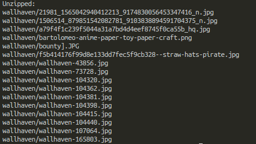

# Unzip Files On S3

##  To Get Started:

Clone repository: `git clone https://github.com/shaeenk/unzip-s3.git`

### Nodejs
1. Make sure you have nodejs and npm installed on your machine.
2. Install the npm packages, each folder under the nodejs parent folder has its own `package.json` this file has the packages you need to run the nodejs program.

### Golang
Not much is needed just the name of the `zip` file and the output folder you want the contents in the `zip` file to be extracted too.

<h6>Console Output:</h6>
